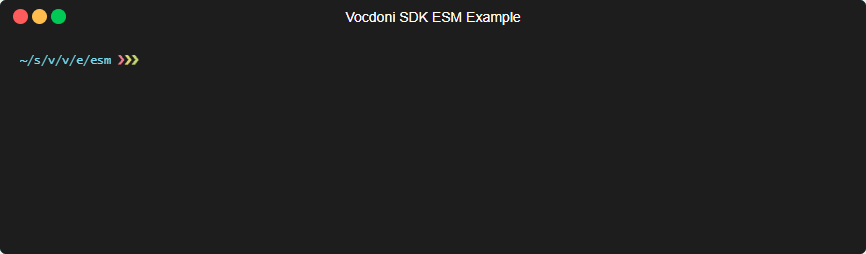

    

# Vocdoni SDK 

The Vocdoni SDK is a convenient way to interact with the Vocdoni Protocol
through [the new API][Vocdoni API], allowing anyone to create, manage and
participate in voting processes and collective decision-making.

## Live preview

You can test the SDK [here](https://vocdoni.github.io/vocdoni-sdk/).

> **No funds needed in your wallet**: Metamask or Walletconnect are only used for
> signing transactions that are sent to the Vocdoni chain! Testing tokens in `dev`
> environment are automatically sent from faucet once the account is created.

See [examples](#examples) for more examples.

## Disclaimer

The Vocdoni SDK and the underlying API is WIP. Please beware that it can be broken
at any time if the release is `alpha` or `beta`. We encourage to review this
repository for any change.

## Prerequisites

You'll need a working [nodejs] environment, but other than that, you're
free to use any package manager (either npm, yarn, pnpm...). Let's start by
adding the SDK to your project:

~~~bash
# with yarn
yarn add @vocdoni/sdk
# with npm
npm i @vocdoni/sdk
# with pnpm
pnpm add @vocdoni/sdk
~~~

For creating elections or vote on them, blockchain transactions need to be
build, thus a signer is required. Any kind of standard [ethers] signer should
work.

This project has been bundled into many formats in order for you to
import it based on the environment you're using it. When importing it via
`@vocdoni/sdk` it will choose a version based on your current environment
(commonjs or esm). There's also another UMD version which can be accessed via
`@vocdoni/sdk/umd` in case you need it.

~~~js
// Will use the correct version based on your environment
import { VocdoniSDKClient } from '@vocdoni/sdk'
// UMD version
import SDK from '@vocdoni/sdk/umd'
~~~

You can see a working ESM example [in the examples folder][example-esm].

## SDK Usage

The entry point is the SDK constructor, it will instantiate a new client
connected to the API endpoint corresponding to `dev` (development) or `stg` (staging).

> For this readme examples, the signer bootstrapping will be ignored and you'll
just see a `signer` constant.

### Environment

#### Staging

This is the **recommended** environment for most testing use cases, since the
`dev` environment is more subject to blockchain resets and downtimes than
the `stg` one.

~~~ts
const client = new VocdoniSDKClient({
  env: EnvOptions.STG, // mandatory, can be 'dev' or 'stg'
  wallet: signer, // optional, the signer used (Metamask, Walletconnect)
})
~~~

#### Development

~~~ts
const client = new VocdoniSDKClient({
  env: EnvOptions.DEV, // mandatory, can be 'dev' or 'stg'
  wallet: signer, // optional, the signer used (Metamask, Walletconnect)
})
~~~

### Registering account

Before creating any new processes, you should register your account against
our blockchain (vochain):

~~~ts
(async () => {
  const info = await client.createAccount()
  console.log(info) // will show account information
})();
~~~

The `createAccount` method will try to fetch an existing account first and, if
it does not exist, it will register it against the blockchain.

The account to be registered will be the one of the signer specified in the
constructor.

You can safely use `createAccount` to fetch any account information, but you can
also decide to just fetch it, without falling back to an account registration:

~~~ts
(async () => {
  const info = await client.fetchAccountInfo()
  console.log(info) // shows info (only if account exists, otherwise throws error)
})();
~~~

The `createAccount` also accepts some information about the account:

~~~ts
(async () => {
  const account = new Account({
    languages: ['es'],
    name: {
      es: 'Nombre de la cuenta',
      default: 'Account name',
    },
    description: 'Description of the account',
    feed: 'https://feed.io',
    avatar: 'https://avatar.io',
    header: 'https://header.io',
    logo: 'https://logo.io',
    meta: [
      { key: 'twitter', value: 'https://twitter.com/@orghandle' },
      { key: 'someIpfsValue', value: 'ipfs://QmXxgLNRSeK6jtFkJ9TsL8nYxFnJ8RKa2xXHUFKGankX6k' },
      { key: 'someArbitraryData', value: [123, 456] },
      { key: 'someEmptyData', value: {} },
    ],
  });
  const info = await client.createAccount({ account })
})();
~~~

### Vocdoni tokens; faucet & balance

Accounts require Vocdoni tokens in order to be able to register against our
blockchain. The process above will automatically fetch some tokens from a faucet
**under development**. For production environments, you should contact us (Vocdoni)
for a byte64 string faucet, and specify it when creating your account:

~~~ts
(async () => {
  const info = await client.createAccount({
    faucetPackage: "<b64string>"
  })
})();
~~~

Accounts also require Vocdoni tokens in order to create new processes.

You can check the balance thanks to the previous methods (`createAccount` and/or
`fetchAccountInfo`) and, under development, you can request new tokens thanks
to the included faucet:

~~~ts
(async () => {
  const info = await client.createAccount()
  if (info.balance === 0) {
    await client.collectFaucetTokens()
  }
})();
~~~

> Note: the `collectFaucetTokens` method only works under development environment
> and for accounts with not enough tokens to create new processes.

### Creating a voting process

After you successfully registered your account against Vocdoni's blockchain, you
can start creating processes.

A process will require a census of people who will vote it. Let's start creating
it:

~~~ts
const census = new PlainCensus()
// accepts any ethereum-alike addresses
census.add(address)
census.add('0x0000000000000000000000000000000000000000')
(async () => {
  // random wallet, for example purposes
  census.add(await Wallet.createRandom().getAddress())
})();
~~~

After you got all the addresses for your census, you may as well create the
process instance:

The simplest form to create an election with the minimum parameters is:

~~~ts
const election = Election.from({
  title: 'Election title',
  description: 'Election description',
  endDate: new Date('2023-01-23 23:23:23'),
  census,
})
~~~

Check out the [election params interface] to see all the allowed params. There are several
options for creating custom types of elections or voting methods:

~~~ts
const election = Election.from({
  title: {
    en: 'This is a test in english',
    es: 'Esto es un test en castellano',
    default: 'This is the default title',
  },
  description: 'Election description',
  // a header image for your election (this is for example purposes; avoid using random sources)
  header: 'https://source.unsplash.com/random/2048x600',
  // a stream uri image for your election (this is for example purposes; avoid using random sources)
  streamUri: 'https://source.unsplash.com/random/2048x600',
  startDate: new Date('2023-01-23 12:00:00'),
  endDate: new Date('2023-01-23 23:23:23'),
  census,
  electionType: {
    autoStart: true, // if the election can start automatically at start date
    interruptible: true, // if the election can be paused or ended
    dynamicCensus: false, // if the census can be changed
    secretUntilTheEnd: false, // if the election has to be secret until end date
    anonymous: false, // if the election is anonymous
  },
  voteType: {
    uniqueChoices: false, // if the choices are unique when voting
    maxVoteOverwrites: 0, // number of times a vote can be overwritten
    costFromWeight: false, // for cuadrating voting
    costExponent: 10000, // for cuadrating voting
  }
})
~~~

Of course, you will also need some questions in this voting process, how would people
vote otherwise?

~~~ts
election.addQuestion('Ain\'t this process awesome?', 'Question description', [
  {
    title: 'Yes',
    value: 0,
  },
  {
    title: 'No',
    value: 1,
  },
]).addQuestion('How old are you?', 'Question description', [
  {
    title: 'Child (0-9 yo)',
    value: 0,
  },
  {
    title: 'Kid (10-16 yo)',
    value: 1,
  },
  {
    title: 'Adult (17-60 yo)',
    value: 2,
  },
  {
    title: 'Elder (60+ yo)',
    value: 3,
  },
])
~~~

> If you're a developer, maybe the value set to zero in Yes (and vice-versa)
> confuses you. Note that this is a mapping of values; people voting on Yes will
> properly set the value as specified (zero in this case), thus printing the
> results as you expect.

You can finally confirm the transaction in the blockchain by just calling
`createElection`:

~~~ts
(async () => {
  const id = await client.createElection(election)
  console.log(id) // will show the created election id
})();
~~~

The election id you got there will be the one you use to access the election.
After a few seconds of creating it, you should be able to check it on
[our explorer][vochain explorer] (or the [dev one][dev vochain explorer] if
you're using the development environment).

### Other election types

#### Quadratic voting

Here is a [full working example][quadratic voting example] of how to create a quadratic voting election.
More information can be found in the [documentation][quadratic voting documentation].

#### Approval voting

Here is a [full working example][approval voting example] of how to create an approval voting election.
More information can be found in the [documentation][approval voting documentation].

#### Ranked voting

Here is a [full working example][ranked voting example] of how to create a ranked voting election.
More information can be found in the [documentation][ranked voting documentation].

### Other election functionalities

#### Estimate election cost

This is a fast function (most times will resolve automatically) which allows to estimate a election price in tokens:

~~~ts
(async () => {
  const price = await client.estimateElectionCost(election) // Should be an UnpublishedElection
  console.log(price) // shows the estimation price
})();
~~~

#### Calculate the real election cost

This function returns the exact election price in tokens:

~~~ts
(async () => {
  const price = await client.calculateElectionCost(election) // Should be an UnpublishedElection
  console.log(price) // shows the real price
})();
~~~

### Fetching election info

You can always access a election information and metadata using `fetchElection`:

~~~ts
(async () => {
  const info = await client.fetchElection(id)
  console.log(info) // shows election information and metadata
})();

// or...
(async () => {
  client.setElectionId(id)
  const info = await client.fetchElection()
  console.log(info) // shows election information and metadata
})();
~~~

See the [PublishedElection class][publishedelection class] details for more information
about the returning object.

You can also fetch all the elections created for a given account using `fetchElections`:

~~~ts
(async () => {
  const elections = await client.fetchElections('0x3d0380f4dcc8aa87be30ef0e38f56dfefeb1cfad')
  console.log(elections) // Array of PublishedElection
})();

// it can be paginated using the second parameter
(async () => {
  const elections = await client.fetchElections('0x3d0380f4dcc8aa87be30ef0e38f56dfefeb1cfad', 2)
  console.log(elections) // Array of PublishedElection
})();
~~~

### Changing election status

See the [Election lifecycle states][election-lifecycle-states] details for more information
about the election status and the possible status changes once the election is created.

#### Pause

~~~ts
(async () => {
  await client.pauseElection(id)
  const election = await client.fetchElection(id)
  console.log(election.status) // Matches ElectionStatus.PAUSED
})();
~~~

#### Cancel

~~~ts
(async () => {
  await client.cancelElection(id)
  const election = await client.fetchElection(id)
  console.log(election.status) // Matches ElectionStatus.CANCELED
})();
~~~

#### End

~~~ts
(async () => {
  await client.endElection(id)
  const election = await client.fetchElection(id)
  console.log(election.status) // Matches ElectionStatus.ENDED
})();
~~~

#### Continue

~~~ts
(async () => {
  await client.continueElection(id)
  const election = await client.fetchElection(id)
  console.log(election.status) // Matches ElectionStatus.READY
})();
~~~

### Voting to a process

#### Check if a user is in census

~~~ts
(async () => {
  const isInCensus = await client.isInCensus();
  console.log(isInCensus) // true or false
})();
~~~

#### Check if a user has already voted

~~~ts
(async () => {
  const hasAlreadyVoted = await client.hasAlreadyVoted();
  console.log(hasAlreadyVoted) // returns the vote identifier or null
})();
~~~

#### Get how many times the user can submit a vote (vote rewrite)

~~~ts
(async () => {
  const votesLeft = await client.votesLeftCount();
  console.log(votesLeft) // number of times the user can submit his vote
})();
~~~

#### Check if a user is able to vote

~~~ts
(async () => {
  const isAbleToVote = await client.isAbleToVote();
  console.log(isAbleToVote) // true or false
})();
~~~

#### Vote

To vote a process you only need two things: the process id to vote to, and the
option (or options) being voted:

~~~ts
(async () => {
  client.setElectionId(id)
  // votes "Yes" and "Adult (17-60 yo)"
  const vote = new Vote([0, 2]);
  const voteId = await client.submitVote(vote)
})();
~~~

### Other SDK functionalities

#### Generate a random Wallet

You can use the `generateRandomWallet` function to generate a random Wallet and assign it to the client.
This function returns the private key of the Wallet.

~~~ts
const privateKey = client.generateRandomWallet();
console.log(privateKey) // the private key of the wallet
~~~

#### Generate deterministic Wallet from data

For some cases where the voters don't have an owned Wallet, we can generate a deterministic
Wallet based on arbitrary data, like, for example, the user and hash password from a custom CRM.

Here is an example where a Wallet is generated using the username and the hash of the password
which we would use to identify the user in our platform. This Wallet can then be used for the
census and for voting purposes.

~~~ts
// 9f86d081884c7d659a2feaa0c55ad015a3bf4f1b2b0b822cd15d6c15b0f00a08 is the sha256 of 'test'
const userWallet = VocdoniSDKClient.generateWalletFromData(['user1', '9f86d081884c7d659a2feaa0c55ad015a3bf4f1b2b0b822cd15d6c15b0f00a08']);
console.log(userWallet) // address is 0x8AF1b3EDB817b5854e3311d583905a3421F49829
~~~

### Advanced

#### Use a CSP to validate participants in an election

The SDK comes with an implementation of the common handler API of a CSP which is explained
[here](https://github.com/vocdoni/blind-csp#api).

For creating a CSP based election, a `CspCensus` has to be set to the election. This census need the
CSP public key (`CSP_PUBKEY` in the example) and the CSP Url (`CSP_URL` in the example). 

~~~ts
const election = Election.from({
  title: 'Election title',
  description: 'Election description',
  // a header image for your process (this is for example purposes; avoid using random sources)
  header: 'https://source.unsplash.com/random/2048x600',
  endDate: new Date('2023-01-23 23:23:23'),
  census: new CspCensus(CSP_PUBKEY, CSP_URL),
})
// The election can be created the same way from here...
~~~

The SDK comes with some wrappers to get a blind signature from the CSP in order to vote.
The complete flow is shown here:

~~~ts
// Client initialization
const client = new VocdoniSDKClient({
  env: EnvOptions.DEV,
  wallet: signer, // the signer used (Metamask, Walletconnect)
  electionId: '934234...', // The election identifier (has to be a CSP configured election)
})

// Auth steps for the CSP (can vary of the type of the CSP)
const step0 = (await client.cspStep(0, ['Name test'])) as ICspIntermediateStepResponse;
const step1 = (await client.cspStep(
  1,
  [step0.response.reduce((acc, v) => +acc + +v, 0).toString()],
  step0.authToken
)) as ICspFinalStepResponse;

// Get the blind signature
const signature = await client.cspSign(signer.address, step1.token);

// Get the vote based on the signature
const vote = client.cspVote(new Vote([index % 2]), signature);

// Vote
const voteId = await client.submitVote(vote);
~~~

## Census3

### What is Census3?

Census3 is an API service to create censuses for elections with holders of a single token or a combination of them.
The service creates a list of holder addresses and balances and keeps it updated in real time, for every registered token.
Then, it allows creating a merkle tree census (compatible with [Vocdoni](https://vocdoni.io/)) with those holders, using their balances as vote weights.

More information about Census3 can be found [here](https://github.com/vocdoni/census3).

### Using Census3

The SDK comes with an implementation of the [Census3 API](https://github.com/vocdoni/census3/blob/main/api/README.md).

#### Creating a Census3 client

~~~ts
const client = new VocdoniCensus3Client({
  env: EnvOptions.DEV // dev environment
})
~~~

#### Getting basic service information

~~~ts
// Get the supported chains
const supportedChains = await client.getSupportedChains();
// [
//     {
//     "chainID": 1,
//     "shortName": "eth",
//     "name": "Ethereum Mainnet"
//     }, 
//     {
//       "chainID": 5,
//       "shortName": "gor",
//       "name": "Goerli"
//     },
//     {
//       "chainID": 137,
//       "shortName": "matic",
//       "name": "Polygon Mainnet"
//     },
//     {
//       "chainID": 80001,
//       "shortName": "maticmum",
//       "name": "Mumbai"
//     }
// ]
~~~

~~~ts
// Get the supported token types
const supportedTypes = await client.getSupportedTypes();
// ["erc20", "erc777", "poap", "unknown", "erc721burned", "erc1155", "nation3", "want", "erc721"]
~~~

#### Getting tokens information and creating them

~~~ts
// Get the supported tokens
const supportedTokens = await client.getSupportedTokens();
// [
//   {
//     "ID": "0x0AaCfbeC6a24756c20D41914F2caba817C0d8521",
//     "type": "erc20",
//     "decimals": 18,
//     "startBlock": 10886913,
//     "symbol": "YAM",
//     "totalSupply": "",
//     "name": "YAM",
//     "status": {
//       "atBlock": 18565762,
//       "synced": true,
//       "progress": 100
//     },
//     "size": 14999,
//     "defaultStrategy": 19,
//     "chainID": 1,
//     "chainAddress": "eth:0x0AaCfbeC6a24756c20D41914F2caba817C0d8521"
//   },
//   {
//     "ID": "0x0b38210ea11411557c13457D4dA7dC6ea731B88a",
//     "type": "erc20",
//     "decimals": 18,
//     "startBlock": 11203771,
//     "symbol": "API3",
//     "totalSupply": "",
//     "name": "API3",
//     "status": {
//       "atBlock": 18565763,
//       "synced": true,
//       "progress": 100
//     },
//     "size": 51178,
//     "defaultStrategy": 8,
//     "chainID": 1,
//     "chainAddress": "eth:0x0b38210ea11411557c13457D4dA7dC6ea731B88a"
//   },
//   ...
// ]
~~~

~~~ts
// Get a token by its ID (address) and chain identifier
const token = await client.getToken('0x0AaCfbeC6a24756c20D41914F2caba817C0d8521', 1);
// {
//   "ID": "0x0AaCfbeC6a24756c20D41914F2caba817C0d8521",
//   "type": "erc20",
//   "decimals": 18,
//   "startBlock": 10886913,
//   "symbol": "YAM",
//   "totalSupply": "15164231312592159866595366",
//   "name": "YAM",
//   "status": {
//     "atBlock": 18565783,
//     "synced": true,
//     "progress": 100
//   },
//   "size": 14999,
//   "defaultStrategy": 19,
//   "chainID": 1,
//   "chainAddress": "eth:0x0AaCfbeC6a24756c20D41914F2caba817C0d8521",
//   "tags": []
// }
~~~

~~~ts
// Check if a holder is registered for a given token
const token = await client.isHolderInToken(
  '0x0AaCfbeC6a24756c20D41914F2caba817C0d8521', 
  1, 
  '0x111000000000000000000000000000000000dEaD'
);
// false
~~~

~~~ts
// Creates a new token by passing the address, the type and the chain identifier
const token = await client.createToken('0xa117000000f279d81a1d3cc75430faa017fa5a2e', 'erc20', 1);
~~~

#### Getting strategies information and creating them

~~~ts
// Get the supported strategies
const supportedStrategies = await client.getStrategies();
// [
//   {
//     "ID": 1,
//     "alias": "Default strategy for token CRV",
//     "predicate": "CRV",
//     "uri": "ipfs://bafybeicjqjklqpumewpaue6weg47byz6fwmbg6ozief3w2pgqx7zlwl5ea",
//     "tokens": {
//       "CRV": {
//         "ID": "0xD533a949740bb3306d119CC777fa900bA034cd52",
//         "chainID": 1,
//         "minBalance": "0",
//         "chainAddress": "eth:0xD533a949740bb3306d119CC777fa900bA034cd52"
//       }
//     }
//   },
//   {
//     "ID": 2,
//     "alias": "Default strategy for token UNI",
//     "predicate": "UNI",
//     "uri": "ipfs://bafybeiesxbsbvp2agcuolezec6hvimntqdg3w43xs62mecdj2fyeh5anxu",
//     "tokens": {
//       "UNI": {
//         "ID": "0x1f9840a85d5aF5bf1D1762F925BDADdC4201F984",
//         "chainID": 1,
//         "minBalance": "0",
//         "chainAddress": "eth:0x1f9840a85d5aF5bf1D1762F925BDADdC4201F984"
//       }
//     }
//   },
//   ...
// ]
~~~

~~~ts
// Get the supported strategies by token and chain identifier
const supportedStrategiesByToken = await client.getStrategiesByToken('0x0AaCfbeC6a24756c20D41914F2caba817C0d8521', 1);
// [
//   {
//     "ID": 19,
//     "alias": "Default strategy for token YAM",
//     "predicate": "YAM",
//     "uri": "ipfs://bafybeicddxfktpcmbkvrflifbod6eeaizfab7l5ijggswnn5jwu3uhv4i4",
//     "tokens": {
//       "YAM": {
//         "ID": "0x0AaCfbeC6a24756c20D41914F2caba817C0d8521",
//         "chainID": 1,
//         "minBalance": "0",
//         "chainAddress": "eth:0x0AaCfbeC6a24756c20D41914F2caba817C0d8521"
//       }
//     }
//   },
//   {
//     "ID": 37,
//     "alias": "testStrategy_1699887257144",
//     "predicate": "(YAM OR API3) AND 1INCH",
//     "uri": "ipfs://bafybeic2gw6nb75ledp3jbz46rmdrnti33hgtlm5icfluxn5ol4enqps7i",
//     "tokens": {
//       "1INCH": {
//         "ID": "0x111111111117dC0aa78b770fA6A738034120C302",
//         "chainID": 1,
//         "minBalance": "50",
//         "chainAddress": "eth:0x111111111117dC0aa78b770fA6A738034120C302"
//       },
//       "API3": {
//         "ID": "0x0b38210ea11411557c13457D4dA7dC6ea731B88a",
//         "chainID": 1,
//         "minBalance": "0",
//         "chainAddress": "eth:0x0b38210ea11411557c13457D4dA7dC6ea731B88a"
//       },
//       "YAM": {
//         "ID": "0x0AaCfbeC6a24756c20D41914F2caba817C0d8521",
//         "chainID": 1,
//         "minBalance": "10000",
//         "chainAddress": "eth:0x0AaCfbeC6a24756c20D41914F2caba817C0d8521"
//       }
//     }
//   },
//   ...
// ]
~~~

~~~ts
// Get a strategy on a given identifier
const strategy = await client.getStrategy(1);
// {
//   "ID": 1,
//   "alias": "Default strategy for token CRV",
//   "predicate": "CRV",
//   "uri": "ipfs://bafybeicjqjklqpumewpaue6weg47byz6fwmbg6ozief3w2pgqx7zlwl5ea",
//   "tokens": {
//       "CRV": {
//         "ID": "0xD533a949740bb3306d119CC777fa900bA034cd52",
//         "chainID": 1,
//         "minBalance": "0",
//         "chainAddress": "eth:0xD533a949740bb3306d119CC777fa900bA034cd52"
//       }
//   }
// }
~~~

~~~ts
// Get strategy estimation information for creating census
const size = await client.getStrategyEstimation(1);
// {
//   "size": 5516,
//   "timeToCreateCensus": 3296,
//   "accuracy": 100
// }
~~~

~~~ts
// Creates a new strategy by passing the alias, the predicate and the tokens information
const strategyId = await client.createStrategy('test_strategy', '(wANT OR ANT) AND USDC', {
  "wANT": {
    "ID": "0x1324",
    "chainID": 1,
    "minBalance": "10000"
  },
  "ANT": {
    "ID": "0x1324",
    "chainID": 5,
  },
  "USDC": {
    "ID": "0x1324",
    "chainID": 1,
    "minBalance": "50"
  },
});
console.log(strategyId) // strategy identifier
~~~

~~~ts
// Imports a strategy from IPFS by the given cid
const strategy = await client.importStrategy('bafybeicjqjklqpumewpaue6weg47byz6fwmbg6ozief3w2pgqx7zlwl5ea');
// {
//   "ID": 1,
//   "alias": "Default strategy for token CRV",
//   "predicate": "CRV",
//   "uri": "ipfs://bafybeicjqjklqpumewpaue6weg47byz6fwmbg6ozief3w2pgqx7zlwl5ea",
//   "tokens": {
//       "CRV": {
//         "ID": "0xD533a949740bb3306d119CC777fa900bA034cd52",
//         "chainID": 1,
//         "minBalance": "0",
//         "chainAddress": "eth:0xD533a949740bb3306d119CC777fa900bA034cd52"
//       }
//   }
// }
~~~

~~~ts
// Validates a predicate for a strategy and returns the parsed predicate in JSON
const validatePredicate = await client.validatePredicate('1INCH AND (YAM OR API3)');
// {
//   "result": {
//   "childs": {
//     "operator": "AND",
//       "tokens": [
//       {
//         "childs": {
//           "operator": "OR",
//           "tokens": [
//             {
//               "literal": "YAM"
//             },
//             {
//               "literal": "API3"
//             }
//           ]
//         }
//       },
//       {
//         "literal": "1INCH"
//       }
//     ]
//   }
// }
// }
~~~

~~~ts
// Gets the supported predicate operators
const operators = await client.getSupportedOperators();
// [
//   {
//     "description": "AND logical operator that returns the common token holders between symbols with fixed balance to 1",
//     "tag": "AND"
//   },
//   {
//     "description": "AND:sum logical operator that returns the common token holders between symbols with the sum of their balances on both tokens",
//     "tag": "AND:sum"
//   },
//   {
//     "description": "AND:mul logical operator that returns the common token holders between symbols with the multiplication of their balances on both tokens",
//     "tag": "AND:mul"
//   },
//   ...
// ]
~~~

#### Getting censuses information and creating them

~~~ts
// Get the supported censuses by strategy identifier
const strategyID = 18;
const censusesByStrategy = await client.getCensuses(strategyID);
// [
//   {
//     "ID": 18569955180,
//     "strategyID": 18,
//     "merkleRoot": "9b1ac0ed374a66b781a22ec5e1b1382324adc0759662e1e6f85fc87f5a23407e",
//     "uri": "ipfs://bafybeihwz2mbkkphgs2ni5laymgtfokaskujg2qfqcvoxhkccbdqp6k7ly",
//     "size": 14999,
//     "weight": "81637958624197446065983341792",
//     "anonymous": false
//   },
//   {
//     "ID": 18569991180,
//     "strategyID": 18,
//     "merkleRoot": "ab1c003b923c4fec0b24f84893ddda8835fd3990904dc64f06c1fc0eadef402f",
//     "uri": "ipfs://bafybeig5jrzw7ayxb442evan4pwa4rfksznh3smyt4exyjkubet2u5ldjm",
//     "size": 14999,
//     "weight": "653103668993579568527866734336",
//     "anonymous": false
//   },
//   ...
// ]
~~~

~~~ts
// Get a census on a given identifier
const census = await client.getCensus(18569955180);
// {
//   "ID": 18569955180,
//   "strategyID": 18,
//   "merkleRoot": "9b1ac0ed374a66b781a22ec5e1b1382324adc0759662e1e6f85fc87f5a23407e",
//   "uri": "ipfs://bafybeihwz2mbkkphgs2ni5laymgtfokaskujg2qfqcvoxhkccbdqp6k7ly",
//   "size": 14999,
//   "weight": "1514939612264202552941935398517220938016694806267744586724593217517874",
//   "anonymous": false
// }
~~~

~~~ts
// Creates a new census by passing the strategy identifier
const strategyID = 18;
const census = await client.createCensus(strategyID);
// {
//   "ID": 18570184180,
//   "strategyID": 18,
//   "merkleRoot": "542166dd4757904449e71d5c21058597ab4179f040ee1f9e7dd29eec622ca5ed",
//   "uri": "ipfs://bafybeifbhmytl6olebkdoas6uftj3ae5akutmji4io6k37ilzu5uli2nle",
//   "size": 14999,
//   "weight": "42801802051163230603042274301444096",
//   "anonymous": false
// }
~~~

~~~ts
// Creates a new census by passing the token address, using the default strategy and returns
// an instance of `TokenCensus` which can be directly used as a census in the Vocdoni chain
const census = await client.createTokenCensus('0x0AaCfbeC6a24756c20D41914F2caba817C0d8521', 1);
console.log(typeof census); // TokenCensus
~~~

~~~ts
// Creates a new census by passing a strategy and returns
// an instance of `StrategyCensus` which can be directly used as a census in the Vocdoni chain
const census = await client.createStrategyCensus(12);
console.log(typeof census); // StrategyCensus
~~~

## Examples

You can find a [full featured vite][example-vite] application with all the previous
steps in the [examples] folder. In that folder you'll also find a
[es modules example][example-esm], creating and voting an election process.

## Docs

You can find the autogenerated docs in our [Developer Portal][devportal] or you
can build them following [this guide][builddocs].

## License

This SDK is licensed under the [GNU Affero General Public License v3.0][license].

    Vocdoni API Typescript SDK
    Copyright (C) 2022 Vocdoni Roots MCU

    This program is free software: you can redistribute it and/or modify
    it under the terms of the GNU Affero General Public License as published by
    the Free Software Foundation, either version 3 of the License, or
    (at your option) any later version.

    This program is distributed in the hope that it will be useful,
    but WITHOUT ANY WARRANTY; without even the implied warranty of
    MERCHANTABILITY or FITNESS FOR A PARTICULAR PURPOSE.  See the
    GNU Affero General Public License for more details.

    You should have received a copy of the GNU Affero General Public License
    along with this program.  If not, see <https://www.gnu.org/licenses/>.

[Vocdoni API]: https://vocdoni.io/api
[nodejs]: https://nodejs.org
[ethers]: https://github.com/ethers-io/ethers.js
[vochain explorer]: https://explorer.vote
[dev vochain explorer]: https://dev.explorer.vote
[publishedelection class]: ./src/types/election/published.ts
[election-lifecycle-states]: https://developer.vocdoni.io/get-started/intro#election-lifecycle-states
[election params interface]: ./src/types/election/election.ts#23
[examples]: ./examples
[example-vite]: ./examples/vite-react-app
[example-esm]: ./examples/esm
[quadratic voting example]: ./examples/typescript/src/quadratic.ts
[quadratic voting documentation]: https://developer.vocdoni.io/protocol/ballot#quadratic-voting
[approval voting example]: ./examples/typescript/src/approval.ts
[approval voting documentation]: https://developer.vocdoni.io/protocol/ballot#multiquestion
[ranked voting example]: ./examples/typescript/src/ranked.ts
[ranked voting documentation]: https://developer.vocdoni.io/protocol/ballot#linear-weighted-choice
[license]: ./LICENSE
[devportal]: https://developer.vocdoni.io/sdk
[builddocs]: ./docs/README.md
