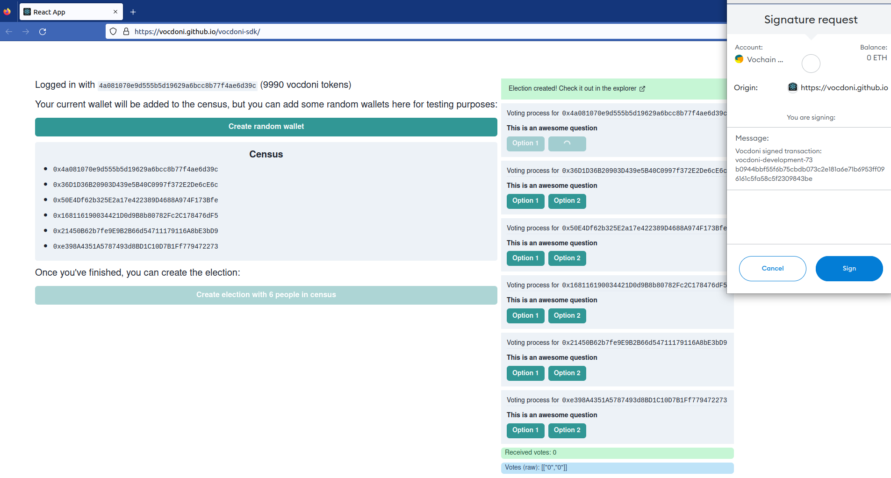

# Vocdoni SDK

The Vocdoni SDK is a convenient way to interact with the Vocdoni Protocol
through [the new API][Vocdoni API], allowing anyone to create, manage and
participate in voting processes and collective decision-making.

## Live preview

You can test the SDK [here](https://vocdoni.github.io/vocdoni-sdk/).

> **No funds needed in your wallet**: Metamask or Walletconnect are only used for
> signing transactions that are sent to the Vocdoni chain! Testing tokens in `dev`
> environment are automatically sent from faucet once the account is created.

## Disclaimer

The Vocdoni SDK and the underlying API is WIP. Please beware that it can be broken
at any time if the release is `alpha` or `beta`. We encourage to review this
repository for any change.

## Prerequisites

You'll need a working [nodejs] environment, but other than that, you're
free to use any package manager (either npm, yarn, pnpm...). Let's start by
adding the SDK to your project:

~~~bash
# with yarn
yarn add @vocdoni/sdk
# with npm
npm i @vocdoni/sdk
# with pnpm
pnpm add @vocdoni/sdk
~~~

For creating elections or vote on them, blockchain transactions need to be
build, thus a signer is required. Any kind of standard [ethers] signer should
work.

For this readme examples, the signer bootstrapping will be ignored and you'll
just see a `signer` constant.

## SDK Usage

The entry point is the SDK constructor, it will instantiate a new client
connected to the API endpoint corresponding to `dev` (development) or `stg` (staging).

### Environment

#### Staging

This is the recommended environment for most testing use cases.

~~~ts
const client = new VocdoniSDKClient({
  env: EnvOptions.STG, // mandatory, can be 'dev' or 'prod'
  wallet: signer, // optional, the signer used (Metamask, Walletconnect)
})
~~~

#### Development

~~~ts
const client = new VocdoniSDKClient({
  env: EnvOptions.DEV, // mandatory, can be 'dev' or 'prod'
  wallet: signer, // optional, the signer used (Metamask, Walletconnect)
})
~~~

### Registering account

Before creating any new processes, you should register your account against
our blockchain (vochain):

~~~ts
(async () => {
  const info = await client.createAccount()
  console.log(info) // will show account information
})();
~~~

The `createAccount` method will try to fetch an existing account first and, if
it does not exist, it will register it against the blockchain.

The account to be registered will be the one of the signer specified in the
constructor.

You can safely use `createAccount` to fetch any account information, but you can
also decide to just fetch it, without falling back to an account registration:

~~~ts
(async () => {
  const info = await client.fetchAccountInfo()
  console.log(info) // shows info (only if account exists, otherwise throws error)
})();
~~~

### Vocdoni tokens; faucet & balance

Accounts require Vocdoni tokens in order to be able to register against our
blokchain. The process above will automatically fetch some tokens from a faucet
**under development**. For production environments, you should contact us (Vocdoni)
for a byte64 string faucet, and specify it when creating your account:

~~~ts
(async () => {
  const info = await client.createAccount({
    faucetPackage: "<b64string>"
  })
})();
~~~

Accounts also require Vocdoni tokens in order to create new processes.

You can check the balance thanks to the previous methods (`createAccount` and/or
`fetchAccountInfo`) and, under development, you can request new tokens thanks
to the included faucet:

~~~ts
(async () => {
  const info = await client.createAccount()
  if (info.balance === 0) {
    await client.collectFaucetTokens()
  }
})();
~~~

> Note: the `collectFaucetTokens` method only works under development environment
> and for accounts with not enough tokens to create new processes.

### Creating a voting process

After you successfully registered your account against Vocdoni's blockchain, you
can start creating processes.

A process will require a census of people who will vote it. Let's start creating
it:

~~~ts
const census = new PlainCensus()
// accepts any ethereum-alike addresses
census.add(address)
census.add('0x0000000000000000000000000000000000000000')
(async () => {
  // random wallet, for example purposes
  census.add(await Wallet.createRandom().getAddress())
})();
~~~

Note you can also use compressed public keys when adding them to the census:

~~~ts
census.add(computePublicKey(Wallet.createRandom().publicKey, true));
~~~

After you got all the addresses for your census, you may as well create the
process instance:

~~~ts
const election = Election.from({
  title: 'Election title',
  description: 'Election description',
  // a header image for your process (this is for example purposes; avoid using random sources)
  header: 'https://source.unsplash.com/random/2048x600',
  endDate: new Date('2023-01-23 23:23:23'),
  census,
})
~~~

Check out the [election interface] to see all the allowed params.

Of course, you will also need some questions in this voting process, how would people
vote otherwise?

~~~ts
election.addQuestion('Ain\'t this process awesome?', [
  {
    title: 'Yes',
    value: 0,
  },
  {
    title: 'No',
    value: 1,
  },
]).addQuestion('How old are you?', [
  {
    title: 'Child (0-9 yo)',
    value: 0,
  },
  {
    title: 'Kid (10-16 yo)',
    value: 1,
  },
  {
    title: 'Adult (17-60 yo)',
    value: 2,
  },
  {
    title: 'Elder (60+ yo)',
    value: 3,
  },
])
~~~

> If you're a developer, maybe the value set to zero in Yes (and viceversa)
> confuses you. Note that this is a mapping of values; people voting on Yes will
> properly set the value as specified (zero in this case), thus printing the
> results as you expect.

You can finally confirm the transaction in the blockchain by just calling
`createElection`:

~~~ts
(async () => {
  const id = await client.createElection(election)
  console.log(id) // will show the created election id
})();
~~~

The election id you got there will be the one you use to access the election.
After a few seconds of creating it, you should be able to check it on
[our explorer][vochain explorer] (or the [dev one][dev vochain explorer] if
you're using the development environment).

### Fetching process info

You can always access a process information and metadata using `fetchElection`:

~~~ts
(async () => {
  const info = await client.fetchElection(id)
  console.log(info) // shows election information and metadata
})();

// or...
(async () => {
  client.setElectionId(id)
  const info = await client.fetchElection()
  console.log(info) // shows election information and metadata
})();
~~~

See the [PublishedElection class][publishedelection class] details for more information
about the returning object.

### Changing election status

See the [Election lifecycle states][election-lifecycle-states] details for more information
about the election status and the possible status changes once the election is created.

#### Pause

~~~ts
(async () => {
  await client.pauseElection(id)
  const election = await client.fetchElection(id)
  console.log(election.status) // Matches ElectionStatus.PAUSED
})();
~~~

#### Cancel

~~~ts
(async () => {
  await client.cancelElection(id)
  const election = await client.fetchElection(id)
  console.log(election.status) // Matches ElectionStatus.CANCELED
})();
~~~

#### End

~~~ts
(async () => {
  await client.endElection(id)
  const election = await client.fetchElection(id)
  console.log(election.status) // Matches ElectionStatus.ENDED
})();
~~~

#### Continue

~~~ts
(async () => {
  await client.continueElection(id)
  const election = await client.fetchElection(id)
  console.log(election.status) // Matches ElectionStatus.READY
})();
~~~

### Voting to a process

To vote a process you only need two things: the process id to vote to, and the
option (or options) being voted:

~~~ts
(async () => {
  client.setElectionId(id)
  // votes "Yes" and "Adult (17-60 yo)"
  const vote = new Vote([0, 2]);
  const voteId = await client.submitVote(vote)
})();
~~~

## Examples

You can find a [full featured CRA][example-cra] application with all the previous
steps in the [examples] folder. In that folder you'll also find a
[simplified Typescript example][example-ts], creating and voting an election
process.

## Docs

You can find the autogenerated docs in our [Developer Portal][devportal] or you
can build them following [this guide][builddocs].

## License

This SDK is licensed under the [GNU Affero General Public License v3.0][license].

    Vocdoni API Typescript SDK
    Copyright (C) 2022 Vocdoni Roots MCU

    This program is free software: you can redistribute it and/or modify
    it under the terms of the GNU Affero General Public License as published by
    the Free Software Foundation, either version 3 of the License, or
    (at your option) any later version.

    This program is distributed in the hope that it will be useful,
    but WITHOUT ANY WARRANTY; without even the implied warranty of
    MERCHANTABILITY or FITNESS FOR A PARTICULAR PURPOSE.  See the
    GNU Affero General Public License for more details.

    You should have received a copy of the GNU Affero General Public License
    along with this program.  If not, see <https://www.gnu.org/licenses/>.

[Vocdoni API]: https://vocdoni.io/api
[nodejs]: https://nodejs.org
[ethers]: https://github.com/ethers-io/ethers.js
[vochain explorer]: https://explorer.vote
[dev vochain explorer]: https://dev.explorer.vote
[publishedelection class]: ./src/types/election/published.ts
[election-lifecycle-states]: https://developer.vocdoni.io/get-started/intro#election-lifecycle-states
[examples]: ./examples
[example-cra]: ./examples/cra
[example-ts]: ./examples/typescript
[license]: ./LICENSE
[devportal]: https://developer.vocdoni.io/sdk
[builddocs]: ./docs/README.md
